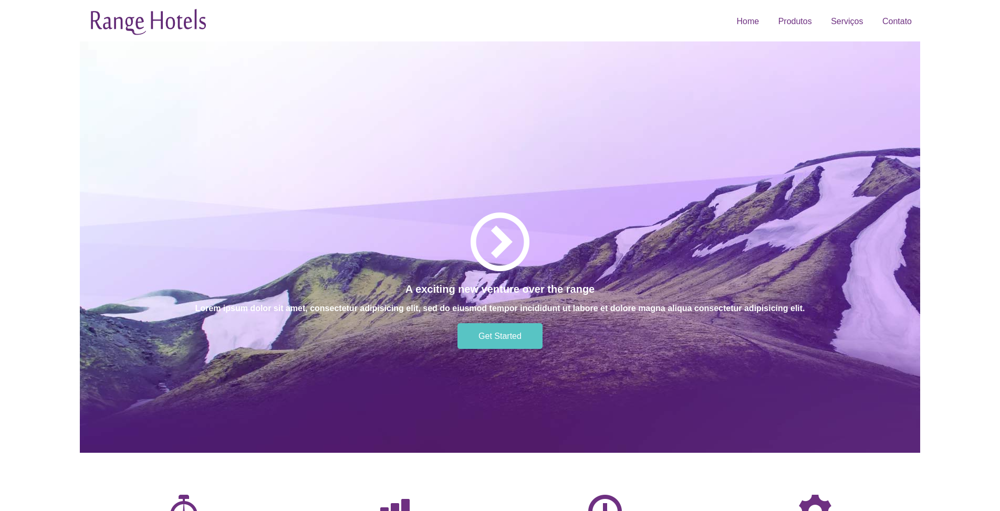
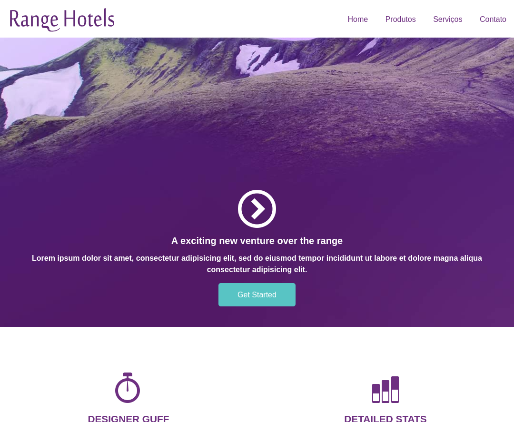
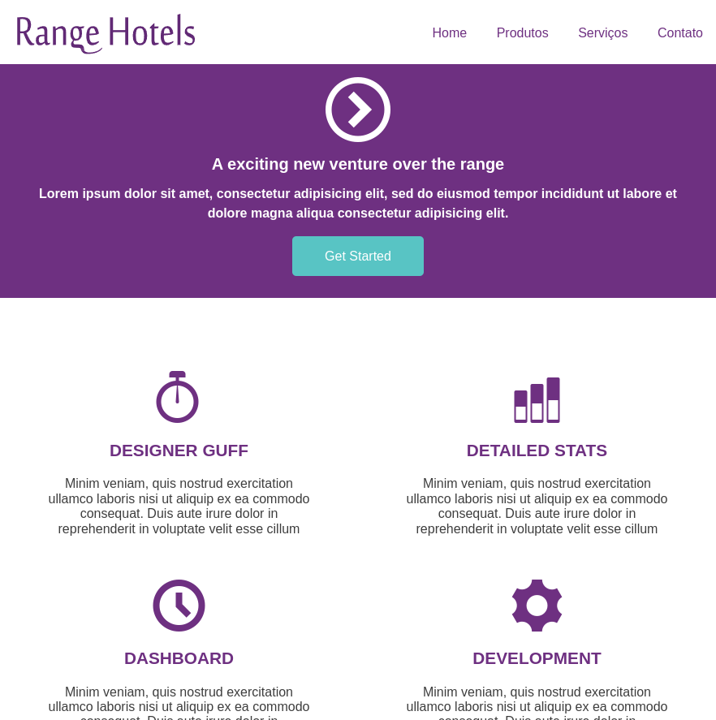
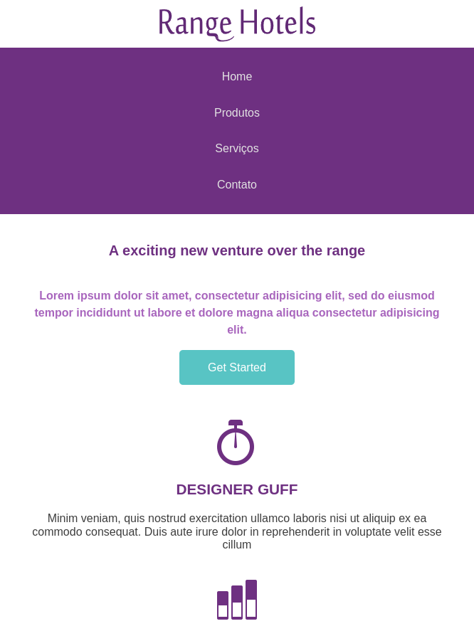

# Range Hotels

HTML and CSS study on responsiveness concepts, mainly mobile first.

# Table of contents
- [About the project](#about-the-project)
  - [Features](#features)
  - [Build with](#build-with)
- [Getting started](#getting-started)
  
## About the project
This project was made to learn about HTML, CSS and responsiveness concepts. It's a simple static website for a hotel.

### Features
Responsiveness is its main feature, as shown below.

Big screen version


Medium size screen version


Small size screen version


Mobile version



### Build with
- [HTML](https://developer.mozilla.org/pt-BR/docs/Web/HTML) - HyperText Markup Language
- [CSS](https://developer.mozilla.org/pt-BR/docs/Web/CSS) - Cascading Style Sheets

## Getting started

### Clone the repository
```
$ git clone https://github.com/gilsongindrejr/range-hotels
```

### get into range-hotels folder
```
$ cd range-hotels
```

### Open the ```index.html``` file with your browser.
